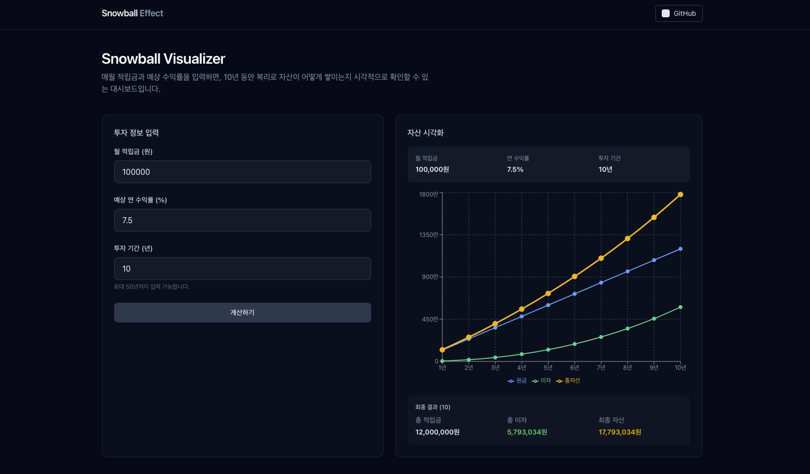

# Snowball Visualizer



복리 투자 시뮬레이터. 월 적립금과 예상 수익률을 입력하면 장기 투자 시 자산이 어떻게 증가하는지 시각화합니다.

## 기능

- 월 적립금, 연 수익률, 투자 기간 입력
- 월 단위 복리 계산
- 연도별 원금/이자/총자산 라인 차트
- 최종 결과 요약

## 기술 스택

- **Framework**: Next.js 16 (App Router)
- **Language**: TypeScript
- **Styling**: Tailwind CSS 4
- **State Management**: Zustand
- **Chart**: Recharts
- **Icons**: Lucide React

## 프로젝트 구조

```
src/
├── app/              # Next.js App Router
│   ├── layout.tsx    # 루트 레이아웃
│   ├── page.tsx      # 메인 페이지
│   └── globals.css   # 전역 스타일
├── components/       # 재사용 컴포넌트
│   ├── InputForm.tsx
│   └── FinancialChart.tsx
└── store/            # Zustand 스토어
    └── useFinancialStore.ts
```

## 시작하기

```bash
# 의존성 설치
npm install

# 개발 서버 실행
npm run dev
```

브라우저에서 [http://localhost:3000](http://localhost:3000) 열기

## 빌드

```bash
npm run build
npm start
```
